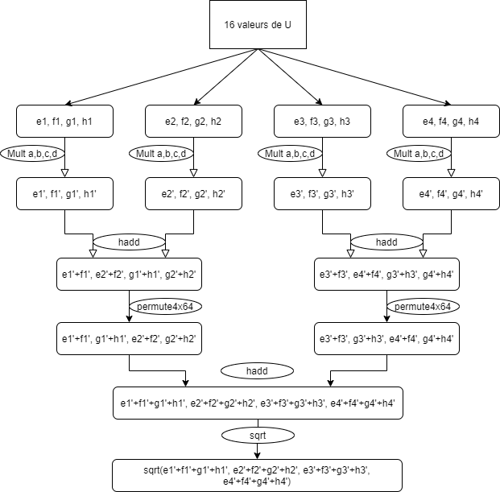

# Projet Supercomputing

## Environnement de Travail

### Packages nécessaires
- `Make`
- `gcc`

### Compilation
Le développement a été réalisé sur Linux, et le programme s'exécute sur **Linux**. Afin de compiler le projet, la commande est la suivante.
```
make
```
Un Makefile est présent dans la racine, qui permet de lancer les différentes commandes `gcc` de build.

### Execution
La commande pour exécuter le projet est 
```
./prog
```

### Options gcc utilisées
- -lpthread : pthread
- -lm : librairie mathématique
- -mavx/mavx2 : calcul vectoriel
- -Wall : Montre tous les warnings
- -ansi
- -pedantic : Ne compile pas si le code ne suit pas une norme

## Fichiers

Les différents exercices sont séparés en plusieurs fichiers 
- main.c : La fonction main lance les différents exercices
- exo1.c : Fonction de l'exercice 1 + test unitaire
- exo2.c : Fonction de l'exercice 2 + test unitaire
- exo3.c : Fonctions de l'exercice 3 + test unitaire
- utils.c : Fonctions utilitaires (horloge système, moyenne, écart-type, moyenne des temps sur K exécutions...)

## Calcul vectoriel
Le code de la fonction vectorielle a été condensé pour avoir une fonction plus rapide. Le code ci-dessous est équivalent.



```
__m256d *ptr = (__m256d*)U;
__m256d carres = _mm256_set_pd(d*d, c*c, b*b, a*a);
__m256d res = _mm256_set_pd(0,0,0,0);

__m256d vec1;
__m256d vec2;
__m256d vec3;
__m256d vec4;

__m256d vec12;
__m256d vec34;

__m256d vecper1;
__m256d vecper2;
__m256d vectot;

for(i = 0; i < (n/4); i += 4, ptr += 4) {
    vec1 = _mm256_mul_pd(carres, *ptr);
    vec2 = _mm256_mul_pd(carres, *(ptr+1));
    vec3 = _mm256_mul_pd(carres, *(ptr+2));
    vec4 = _mm256_mul_pd(carres, *(ptr+3));

    vec12 = _mm256_hadd_pd(vec1, vec2);
    vec34 = _mm256_hadd_pd(vec3, vec4);

    vecper1 = _mm256_permute4x64_pd(vec12, 0b11011000);
    vecper2 = _mm256_permute4x64_pd(vec34, 0b11011000);

    vectot = _mm256_hadd_pd(vecper1, vecper2);
    res += _mm256_sqrt_pd(vectot);
}
```